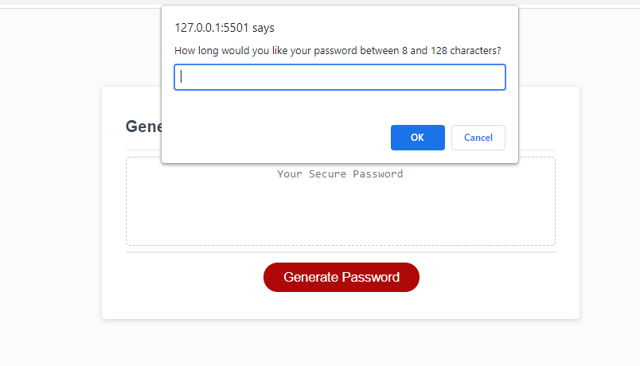
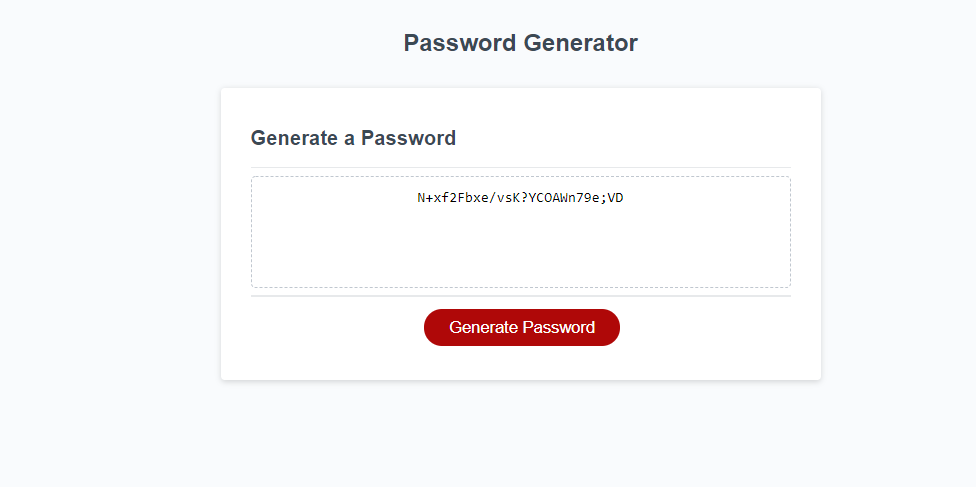

# Homework03---Pwrd-gnrtr
Variables set for different character possiblities including upper and lower case letters, numbers, and special characters. Also set a value variable

Defined a function for generatePassword that included a prompot asking how many characters the password would be and compared this to the range listed in the readme

Set variables to hold true false answer to "confirm" to ask user that type of characters to use

If user confirms to use a character type then run through the characters set in the first variables for that character type

I tried to do a validate variable to check that at least one character was selected

Iterated all of the choices in each character type selected and returned a random answer as the password

 